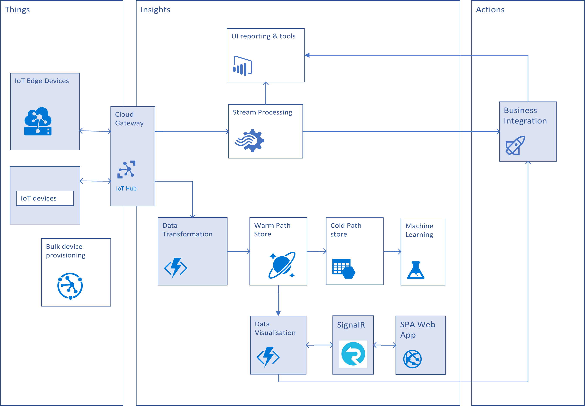
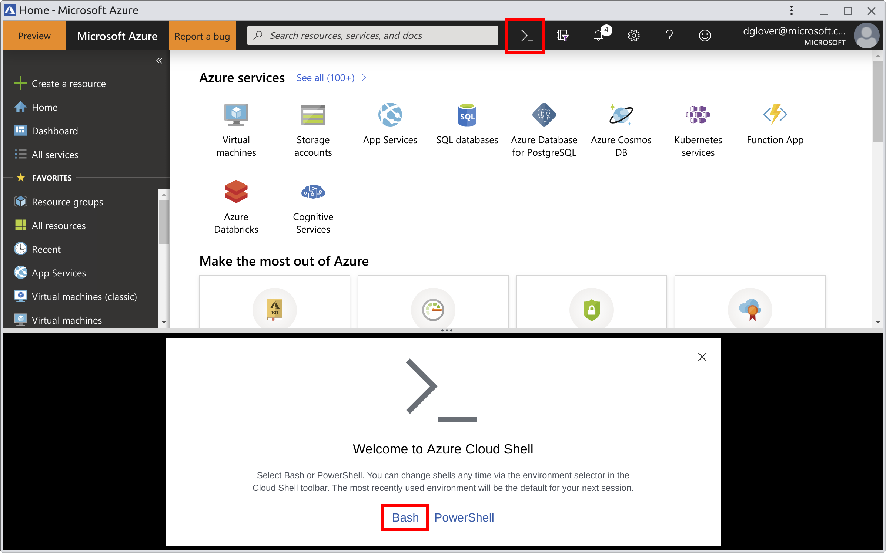
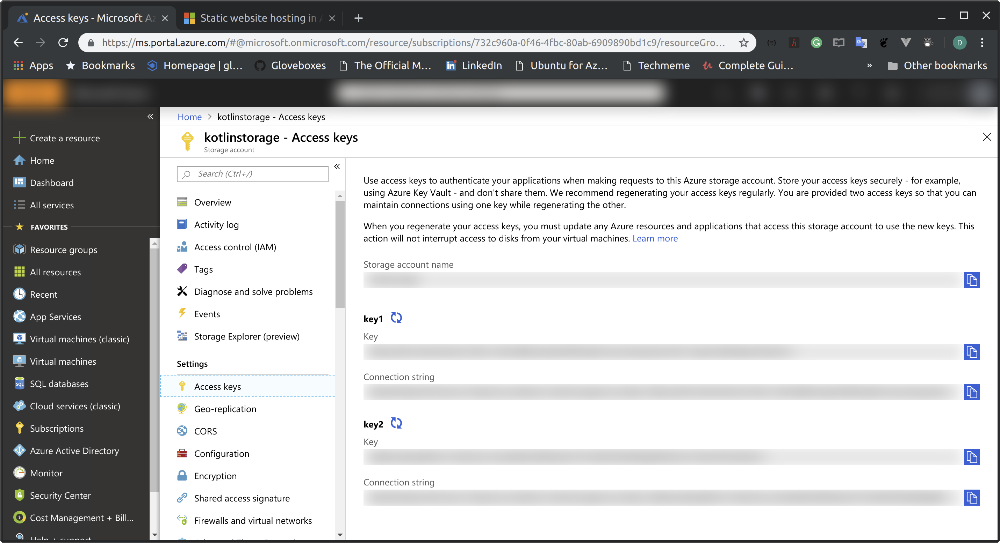

# Creating an IoT Solution with Kotlin Azure Functions

|Author|[Dave Glover](https://developer.microsoft.com/en-us/advocates/dave-glover), Microsoft Cloud Developer Advocate |
|----|---|
|Documentation|[README]()|
|Platform|[Azure IoT Hub](https://docs.microsoft.com/en-us/azure/iot-hub/?WT.mc_id=article-github-dglover), [Azure Functions](https://docs.microsoft.com/en-us/azure/azure-functions/?WT.mc_id=article-github-dglover), [SignalR](https://azure.microsoft.com/en-us/services/signalr-service/?WT.mc_id=article-github-dglover), [Raspberry Pi Simulator](https://azure-samples.github.io/raspberry-pi-web-simulator/)|
|Video Training|[Azure Serverless end-to-end with Functions, Logic Apps, and Event Grid](https://channel9.msdn.com/Blogs/Azure/Azure-Serverless-end-to-end-with-Functions-Logic-Apps-and-Event-Grid?term=azure%20functions&lang-en=true/?WT.mc_id=article-github-dglover)|
|Date|As at March 2019|

## Solution Overview

The following diagram is a typical IoT solution. The boxes **highlighted in blue** are the areas covered in this walk through as this focuses on extending Azure IoT Hub with serverless Azure Functions written in Kotlin, updating a Device State table and driving simple web data visualisation app via the Azure SignalR Service.

For more background information about Azure IoT Hub based solutions then be sure to review the [Azure IoT Reference Architecture Guide](https://azure.microsoft.com/en-au/blog/azure-iot-reference-architecture-update/).



## Set up Requirements


This article shows you:

- How to create a [serverless](https://azure.microsoft.com/overview/serverless-computing/) function project written in Kotlin with IntelliJ IDEA and Apache Maven
- Steps for testing and debugging the function in the integrated development environment (IDE) on your own computer
- Instructions for deploying the function project to Azure Functions

<!-- TODO  -->


## Set up your development environment

To develop a function with Java and IntelliJ, install the following software:

- [Java Developer Kit](https://www.azul.com/downloads/zulu/) (JDK), version 8
- [Apache Maven](https://maven.apache.org), version 3.0 or higher
- [IntelliJ IDEA](https://www.jetbrains.com/idea/download), Community or Ultimate versions with Maven
- [Azure CLI](https://docs.microsoft.com/cli/azure)

> IMPORTANT
>
> The JAVA_HOME environment variable must be set to the install location of the JDK to complete the steps in this article.

## Create an Azure IoT Hub and stream Telemetry

Referenced from [az iot hub](https://docs.microsoft.com/en-us/cli/azure/iot/hub?view=azure-cli-latest)

### STEP 1: Sign in to your Azure Subscription

If you don't have an [Azure subscription](https://docs.microsoft.com/azure/guides/developer/azure-developer-guide#understanding-accounts-subscriptions-and-billing), create a [free account](https://azure.microsoft.com/free/?ref=microsoft.com&utm_source=microsoft.com&utm_medium=docs&utm_campaign=visualstudio) before you begin.

> STUDENTS
>
> If you are a student then signup with [Azure for Students](https://azure.microsoft.com/en-us/free/students/). No credit card is required

### STEP 2: Start the Azure Cloud Shell

From the Azure Portal start the Cloud Shell (Highlighted in RED).

Click the Cloud Shell symbol >_ then select Bash.

 select Bash

### STEP 3: Create the Project Resource Group

Copy and paste the following command into the Bash Cloud Shell

```bash
az group create -l westus -n KotlinResourceGroup
```

### STEP 4: Create an Azure IoT Hub Called MyIotHub

Copy and paste the following command to create a free instance of Azure IoT Hub (Note, you can have only one free IoT Hub per subscription)

```bash
az iot hub create --resource-group KotlinResourceGroup --name MyIotHub --sku F1 --location westus --partition-count 4
```

### STEP 5: Create an Azure IoT Hub Consumer Group

```bash
az iot hub consumer-group create --hub-name MyIotHub --name telemetry-processor
```

### STEP 6: Create an Azure Storage Account

```bash
az storage account create -n kotlinstorage -g KotlinResourceGroup -l westus --sku Standard_LRS --kind StorageV2
```

### STEP 7: Get the newly created Storage Account Connection String



### STEP 8: Create the DeviceState Storage Table

```bash
az storage table create --name DeviceState --connection-string "<kotlinstorage connection string>"
```

### STEP 9: Create the Calibration Storage Table

```bash
az storage table create --name Calibration --connection-string "<kotlinstorage connection string>"
```

### STEP 10: Enable Azure Storage Static Websites

https://docs.microsoft.com/en-us/azure/storage/blobs/storage-blob-static-website


```bash
az storage blob service-properties update --account-name kotlinstorage --static-website --index-document index.html
```

### STEP 11: Upload Static Website Content

```bash
az storage blob upload-batch -s <SOURCE_PATH> -d \$web --account-name <ACCOUNT_NAME>
```

### STEP 12: Create SignalR Service

```
az signalr create --name SignalrService --resource-group KotlinResourceGroup --sku Free_DS2 --location westus
```

Follow these instructions: [Connect a Raspberry Pi online simulator to Azure IoT Hub](https://docs.microsoft.com/en-us/azure/iot-hub/iot-hub-raspberry-pi-web-simulator-get-started)


## Devices

### MXChip

If you have an MXChip Device then follow the [Connect IoT DevKit AZ3166 to Azure IoT Hub](https://docs.microsoft.com/en-us/azure/iot-hub/iot-hub-arduino-iot-devkit-az3166-get-started)


### Other

Also see [getting started with Azure IoT Hub and connecting physical devices](https://docs.microsoft.com/en-us/azure/iot-hub/iot-hub-get-started-physical)

## Create an Azure IoT Hub Consumer Group

## Kotlin Azure Functions

Clone the following GitHub repo

```bash
git clone https://github.com/gloveboxes/iot-ttn-kotlin-azure-functions.git
```

## Open the solution with IntelliJ

1. Open the cloned solution in IntelliJ

## Update the local.settings.json


4. Charting Data

